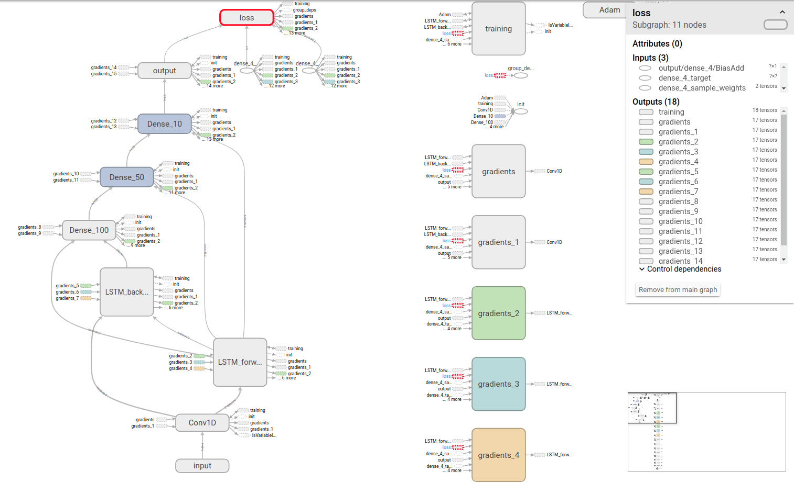

# Bidirectional-LSTM-and-Convolutional-Neural-Network-For-Temperature-Prediction
I use weather data of Ulsan, Korea from 1980 to 2018 to predict temperature.
# Keras with Tensorflow backend
- Please intall it when you want to run.
- Don't forget to set your checkpoints and logs folders
# How to run?
- python train.py
- python test.py
# You can visualize your training process using Tensorboard
- tensorboard --logdir=/logs
# Note: You can only use it for research purposes.

  

